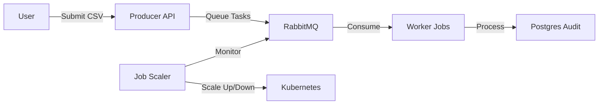
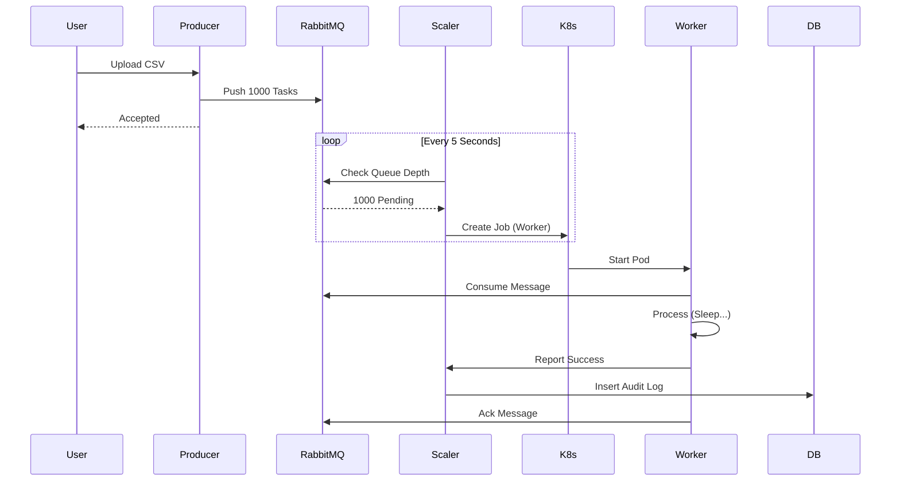

# Control Flow & Architecture

## System Overview
The **KubeJob Fabric** Platform handles asynchronous batch processing using Kubernetes Jobs.

### 1. High Level Flow

### 2. Detailed Lifecycle

#### Step 1: Submission
1.  **User** uploads a CSV file to the Producer API (`/submit/{job_type}`).
2.  **Producer** reads the CSV, converts each row into a JSON task.
3.  Tasks are pushed to a **RabbitMQ** queue (`task_queue`).
4.  Producer returns `200 OK` immediately.

#### Step 2: Scaling Decision (The Brain)
The **Scaler** runs a continuous loop (every 5s):
1.  **Check Queue**: "How many messages are waiting?" (e.g., 500).
2.  **Check Active Jobs**: "How many workers are running?" (e.g., 2).
3.  **Scale Up**:
    *   If `Queue > Threshold` AND `Active < Max Jobs`.
    *   It calls Kubernetes API to spawn new `Job` resources.
    *   New Pods are created.
4.  **Scale Down**:
    *   If `Queue == 0` AND `Unacknowledged == 0` (Idle).
    *   Each Job Type tracks "Idle Ticks".
    *   If idle for 30s (6 ticks), the Scaler deletes the oldest job.

#### Step 3: Worker Processing
1.  **Worker Pod** starts up.
2.  It connects to RabbitMQ and consumes messages.
3.  **Processing**:
    *   Simulates work (sleeps).
    *   Performs calculation (e.g., Spend Analysis).
4.  **Reporting**:
    *   Sends a "Report" back to the Scaler API (`/report-message`).
    *   This is saved to **Postgres** for the Audit Trail.
5.  **Ack**: The worker acknowledges the message to RabbitMQ, removing it from queue.

### 3. Component Interaction Diagram

